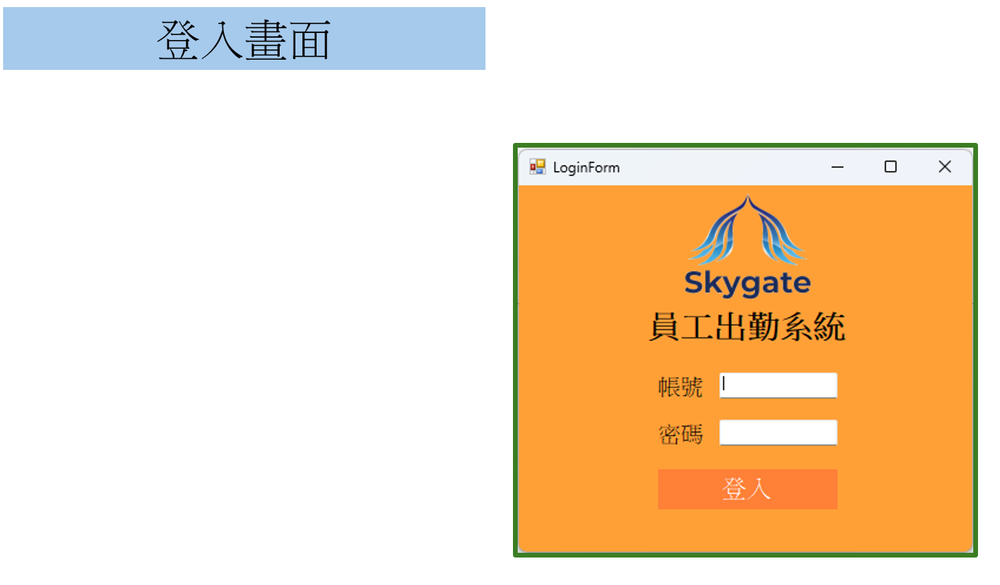
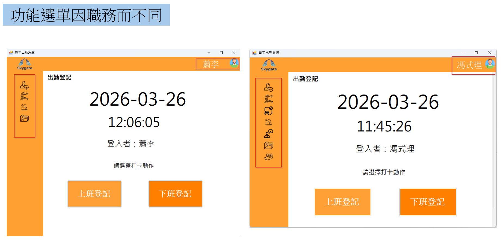
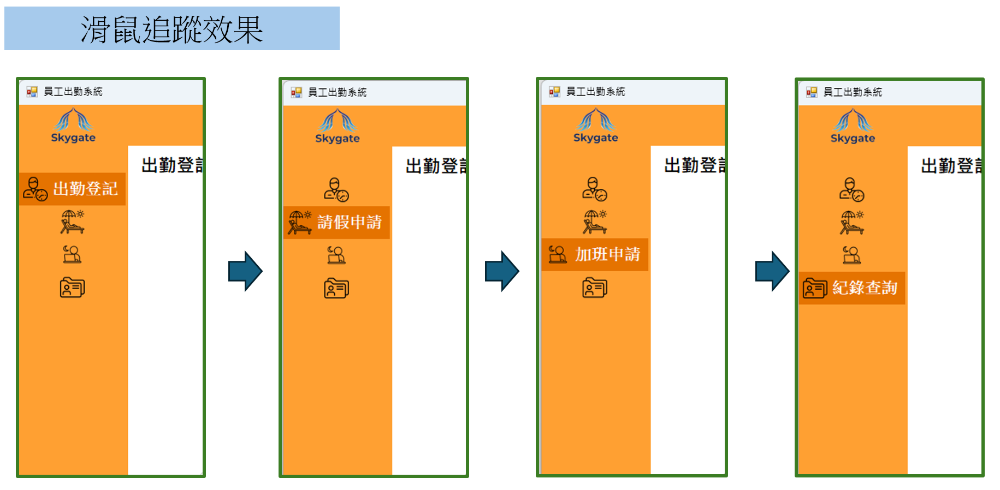
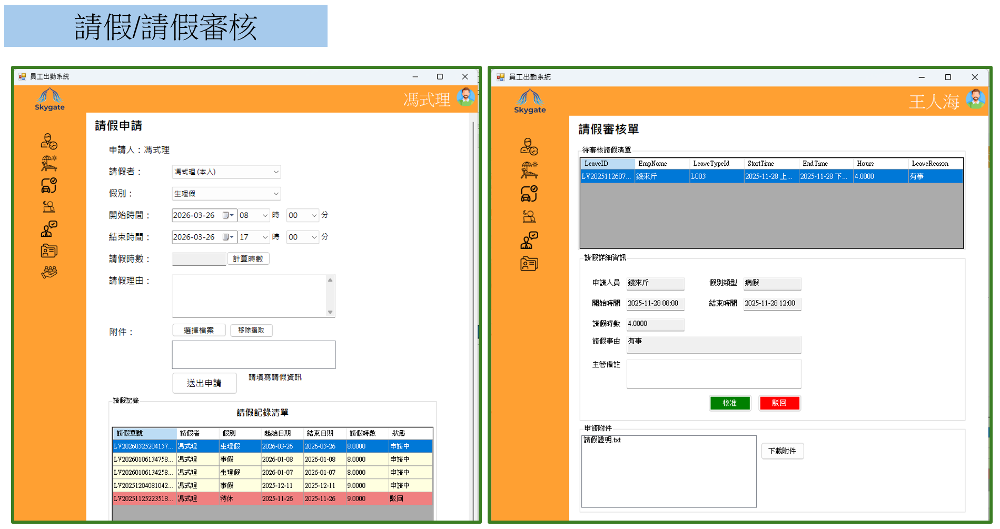
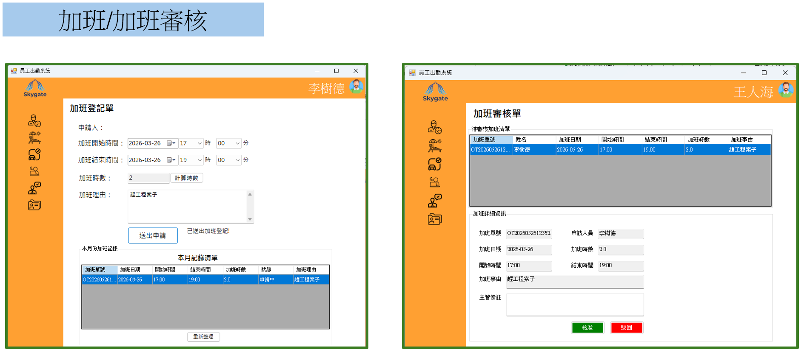
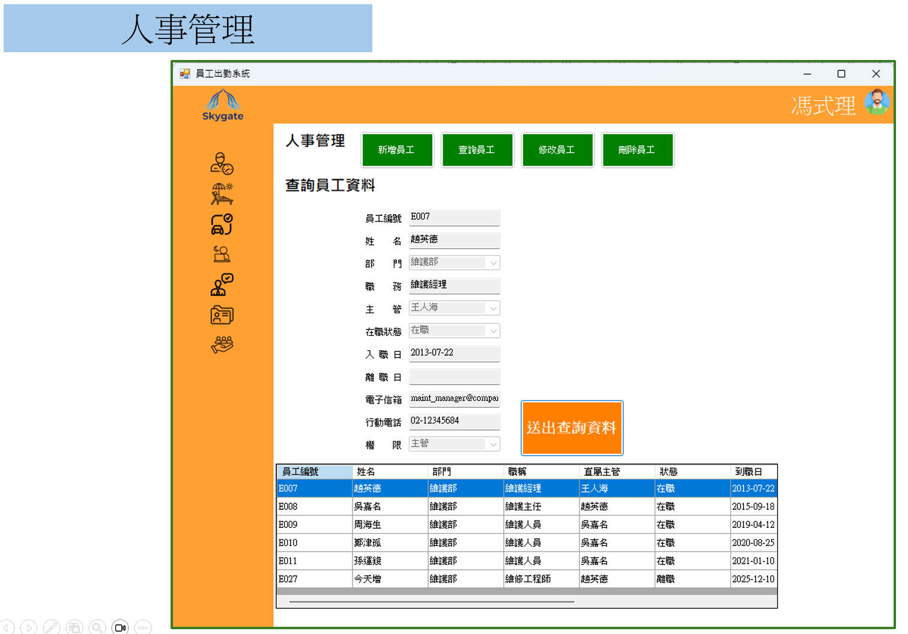
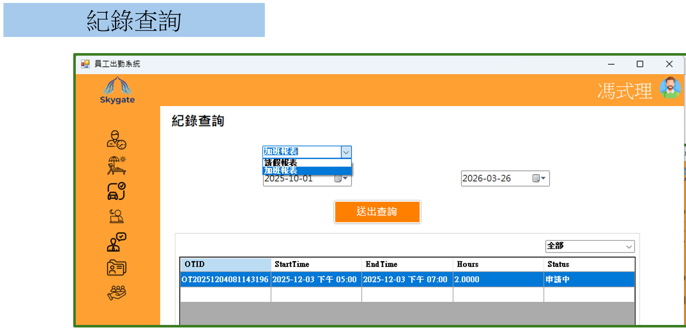

# Skygate-Winform (HR & Attendance Management 練習作品) 👋

本專案是我在學習 C# 與 .NET 期間，將製造業觀察到的行政流程（如請假、加班申請）轉化為軟體的實踐作品。開發重點在於實踐 **「職責分離 (SoC)」** 的設計原則，並建構一個具備高度擴展性的系統架構。

---

## 🛠 實作重點與技術細節 (Implementation Highlights)

### 1. 分層架構 (N-Tier Architecture)
* **介面導向開發 (Interface-Based)**：定義 `IEmployeeRepository` 隔離資料存取邏輯，確保系統具備替換資料庫的靈活性（支援 SQL Server / MySQL），並提升可測試性。
- **職責分離 (SoC)**：嚴格區分 `Entity` (資料實體)、`DTO` (傳輸物件) 與 `ViewModel` (顯示模型)，確保資料流動透明且邏輯嚴謹。
* **獨立 Service Layer**：封裝核心商業邏輯（如工時計算、權限校驗、審核狀態機），確保 UI 層專注於介面互動。

### 2. UI 組件化與動態管理
* **UI 組件化開發**：將功能拆解為多個獨立的 **UserControl**，提升程式碼重用性與視窗開發的條理性。
* **動態佈局組建 (LayoutManager)**： UI 控制組件，使用單一介面內部的多樣功能切換（新增/查詢/修改/刪除），大幅優化使用者操作流程。
* **資料快取**：使用Client-side 緩存機制，支援 DataGridView 「一鍵選取、立即填表」，優化頻繁操作下的系統反應速度。

### 3. 進階業務邏輯實作
* **權限控管 (RBAC)**：根據登入者權限（主管/員工）動態調整功能模組的可視性。
* **事務一致性 (Transaction)**：在異動單據與員工資料時導入 `SqlTransaction`，確保跨表操作具備原子性 (Atomicity)。
* **資料驗證機制**：透過自定義的 `ValidationHelper` 靜態類別，針對 Email、台灣手機門號及特定格式編號 (EmpID/RoleID) 進行預檢，確保資料進入資料庫前格式完整符合。

---

## 📂 技術棧 (Tech Stack)
* **Language**: C# (.NET Framework 4.8)
* **Database**: Microsoft SQL Server (ADO.NET / Entity Framework 5.0)
* **Design Patterns**: Repository Pattern, Service Layer, DTO Design
* **Tools**: Visual Studio, Git

---

## 💡 開發初衷
本專案的核心目標是透過模擬實際的行政作業流程，練習撰寫具備擴展性的程式碼。過程中，我成功掌握了從底層資料庫串接、商業邏輯封裝到前端 UI 組件化的開發全流程，並為日後遷移至 ASP.NET Core MVC 奠定了紮實的架構基礎。

---

## 📸 系統截圖 (Screenshots)

---

[⬅ 回到個人首頁](https://github.com/petter927/petter927)